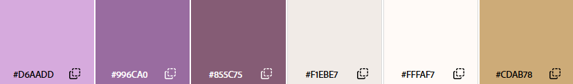

# 🌐 Atividade — Planejamento e Proposta de Site

## 1️⃣ Tema do Site
O grupo escolheu o tema de **Alimentação (Cafeteria e Lanches)**. O projeto visa o desenvolvimento do site para a **Umbra Café**, uma cafeteria focada em cafés especiais e lanches artesanais que une a qualidade de produtos selecionados a um ambiente simples, acolhedor e confortável.

---

## 2️⃣ Proposta do Site
O site funcionará como a vitrine digital da cafeteria e como uma ferramenta de conveniência para o cliente no dia a dia.

* **Objetivo do site:** Apresentar a cafeteria, o cardápio e oferecer um sistema de pedidos online integrado para retirada rápida no balcão.
* **O que o usuário encontrará nele:** Cardápio digital com preços e fotos, história do espaço, horários de funcionamento, localização exata e a ferramenta de pré-pedido.
* **Problema que o site pretende resolver:** O tempo perdido em filas pelo cliente que está com pressa na rotina urbana. O site permite que ele monte seu pedido a caminho do local, agende a retirada e apenas pague o produto pronto no balcão, sem espera de preparo.
* **Informações ou serviços oferecidos:** Consulta ao cardápio atualizado e sistema de carrinho virtual para agendamento de pedidos (retirar e pagar no balcão).

---

## 3️⃣ Definir o Público-Alvo
O site foi desenvolvido para atender frequentadores locais e trabalhadores da região.

* **Faixa etária:** Jovens e adultos de 22 a 40 anos.
* **Interesses:** Cafés de alta qualidade, lanches artesanais, ambientes calmos para leitura ou conversas.
* **Necessidades do público:** Um lugar tranquilo para pausar a rotina, estudar ou trabalhar no notebook, contando com internet rápida e tomadas, além de agilidade máxima no atendimento para os dias de correria.

---

## 4️⃣ Conceito Mobile First

### 📱 Mobile First
O site será pensado e estruturado primeiro para celulares e depois adaptado para telas maiores.

* **Por que escolheu esse modelo:** A maioria das pessoas busca onde comer ou faz pedidos rápidos direto pelo smartphone enquanto está na rua ou no intervalo do trabalho.
* **Como pretende adaptar o site para celular:** Organização do layout em uma única coluna vertical para uma navegação fluida, intuitiva e sem elementos pesados que poluam a tela.
* **Cuidados com:**
  * **Menu:** Uso de um menu oculto (botão de hamburguer) no topo que se abre na tela de forma limpa quando tocado.
  * **Imagens:** Fotos otimizadas e leves que carregam instantaneamente mesmo em conexões de dados móveis.
  * **Textos:** Frases curtas, diretas e com boa legibilidade para consumo rápido de informação na tela do celular.
  * **Organização da tela:** Botões principais e de ação (como "Fazer Pedido") fixados na parte inferior da tela para facilitar o clique usando apenas o polegar.

---

## 5️⃣ Definir a Identidade Visual

* **Cores principais:** A paleta de cores oficial do projeto utiliza tons de roxo, lilás e bege, equilibrando a sofisticação da marca com o conforto visual.
  
  

* **Fontes:** Textos e Títulos utilizando uma fonte clássica (*Times New Roman*).
* **Logo:** A identidade visual gráfica já foi desenvolvida e será aplicada diretamente no topo do site e nos materiais de divulgação.
  
  

* **Nome da empresa/site:** Umbra Café
* **Dados fictícios da empresa:**
  * **Telefone:** (11) 98765-4321
  * **E-mail:** ola.umbracafe@gmail.com
  * **Endereço:** Rua das Sombras, 120 - Vila Madalena, São Paulo - SP
  * **Redes sociais:** Instagram: @cafeumbra_

---

## 6️⃣ Estrutura Inicial do Site
O site contará com uma navegação simples dividida nas seguintes páginas e seções focadas no celular:

* **Home:** Apresentação da logo, menu principal oculto no topo e seções com destaques do cardápio (Cafés, Chás, Sucos, Salgados) com botões rápidos direcionando para o cardápio.
* **Cardápio:** Listagem de produtos com fotos. Página apenas demonstrativa dos produtos, o usuário clica em um botão para se redirecionar para a página de compra.
* **Pedido (Interface de Compra):** Os produtos estão exibidos com suas informações e o cliente pode adicioná-los a seu carrinho. Possui uma barra fixa na parte inferior mostrando o total do carrinho. Ao ser clicada, essa barra expande para cima permitindo que o usuário revise os produtos que escolheu, podendo pedir mais de 1 ou tirar do carrinho.
* **Finalização do Pedido:** Uma tela dedicada que aparece após o cliente clicar em finalizar. Nela, o usuário preenche seus dados básicos e seleciona o horário de retirada agendada. O pagamento é realizado diretamente no balcão da cafeteria no momento da retirada.
* **Sobre Nós:** Seção com carrossel de fotos do espaço físico e a história da cafeteria, mostrando o ambiente preparado para leitura e estudos. Extensão do Google Maps para direcionar o usuário pro aplicativo com o endereço exato.
* **Contato:** Rodapé de todas as páginas contendo e-mail, link do Instagram e endereço fictício.
---

## 7️⃣ Recursos que o Site Pode Utilizar
* **Menu responsivo** que se adapta para qualquer tamanho de tela (celular, tablet ou computador).
* **Sistema de pedidos** com carrinho virtual integrado para agendamento de retirada no balcão.
* **Galeria de imagens** dinâmica mostrando os produtos e o espaço físico.
* **Mapa do Google integrado** para o cliente clicar e abrir direto o GPS do celular.

---